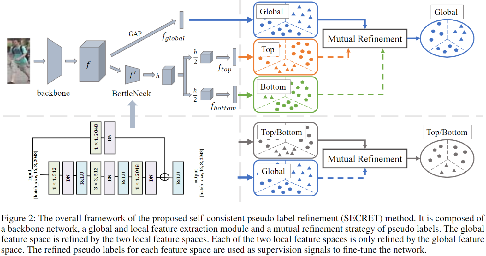
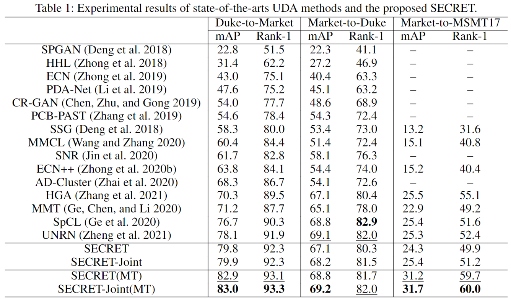

# [AAAI2022] SECRET
The official repository for SECRET: Self-Consistent Pseudo Label Refinement for Unsupervised Domain Adaptive Person Re-Identification.

<!-- [[Video](https://recorder-v3.slideslive.com/?share=60337&s=2dd1e813-4f72-42ca-b4c0-b9fbcc8a8391)] [[Poster](figs/poster.png)] -->



## Installation

```shell
git clone https://github.com/LunarShen/SECRET.git
cd SECRET
conda create -n secret python=3.8
conda activate secret
conda install pytorch==1.8.0 torchvision==0.9.0 torchaudio==0.8.0 cudatoolkit=10.2 -c pytorch
pip install tqdm numpy six h5py Pillow scipy scikit-learn metric-learn pyyaml yacs termcolor faiss-gpu==1.6.3 opencv-python Cython
python setup.py develop
```

## Prepare Datasets

```shell
mkdir Data
```
Download the raw datasets [DukeMTMC-reID](https://arxiv.org/abs/1609.01775), [Market-1501](https://www.cv-foundation.org/openaccess/content_iccv_2015/papers/Zheng_Scalable_Person_Re-Identification_ICCV_2015_paper.pdf), [MSMT17](https://arxiv.org/abs/1711.08565),
and then unzip them under the directory like
```
SECRET/Data
├── dukemtmc
│   └── DukeMTMC-reID
├── market1501
│   └── Market-1501-v15.09.15
└── msmt17
    └── MSMT17_V1
```

## Training

We utilize 4 GTX-1080TI GPUs for training.

### Stage I: Pre-training on the source domain

```shell
# duke-to-market
sh scripts/duke2market/pretrain.sh
# market-to-duke
sh scripts/market2duke/pretrain.sh
# market-to-msmt
sh scripts/market2msmt/pretrain.sh
```

### Stage II: fine-tuning with SECRET

```shell
# duke-to-market
sh scripts/duke2market/train.sh
# market-to-duke
sh scripts/market2duke/train.sh
# market-to-msmt
sh scripts/market2msmt/train.sh
```

## Evaluation

```shell
# duke-to-market
sh scripts/duke2market/eval.sh
# market-to-duke
sh scripts/market2duke/eval.sh
# market-to-msmt
sh scripts/market2msmt/eval.sh
```

## Results


## Acknowledgements
Codebase from [MMT](https://github.com/yxgeee/MMT), [fast-reid](https://github.com/JDAI-CV/fast-reid)

## Citation
If you find this project useful for your research, please cite our paper.
```bibtex
@inproceedings{he2022secret,
  title={SECRET: Self-Consistent Pseudo Label Refinement for Unsupervised Domain Adaptive Person Re-Identification},
  author={He, Tao and Shen, Leqi and Guo, Zhenhua and Guo, Yuchen and Ding, Guiguang},
  booktitle={Proceedings of the AAAI Conference on Artificial Intelligence},
  year={2022}
}
```
